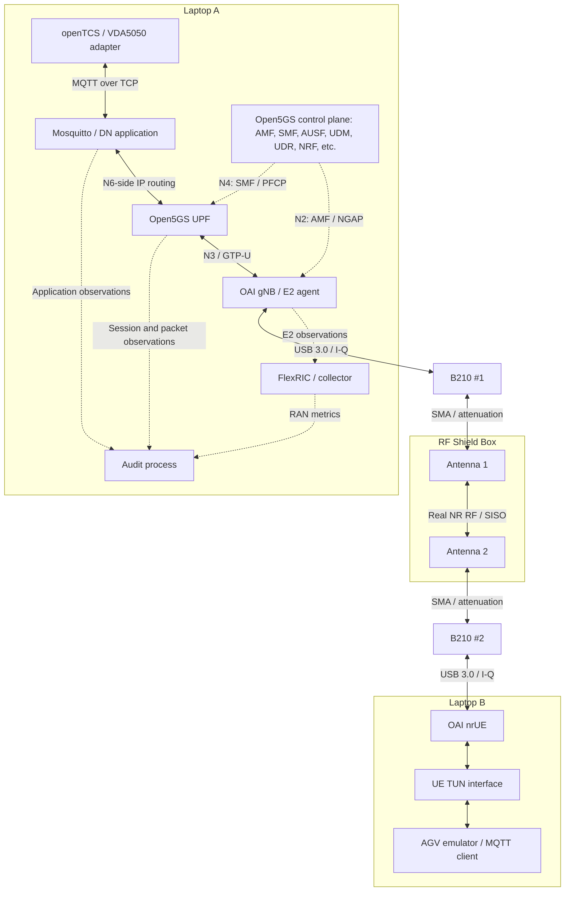

# Fleet Control–MQTT Broker–AGV 개발 언어 및 Private 5G Testbed 구현 가능성

작성일: 2026-09-09  
검토 대상: [step3_testbed.jpg](./step3_testbed.jpg)와 제시된 연구 장비·오픈소스  
검토 범위: Fleet Control–MQTT Broker–가상 AGV 구현을 중심으로, 실제 NR 무선 경유와 향후 Audit Framework 연결에 필요한 조건을 검토한다. **문헌·공식 구현 자료에 따른 설계 검토이며, 보유 장비에서의 구축·성능 실험 결과는 아니다.**

## 1. 두 질문에 대한 답

**개발은 Java와 Python을 중심으로 시작하는 것을 권장한다.** Java는 openTCS 연동·확장, Python은 가상 AGV·실험 시나리오·Audit 분석에 사용한다. OAI/FlexRIC의 계층별 계측을 수정하거나 STM32 펌웨어를 작성할 때 C/C++를 추가한다. Mosquitto와 Open5GS는 우선 설치·설정하여 사용한다. 각 구성요소의 구현 언어와 연구자가 새로 작성해야 할 언어는 구분해야 한다.

**그림의 구성은 소규모 연구용 testbed로 조건부 구현 가능하다.** OAI는 B210을 사용하는 gNB와 별도 호스트의 B210 nrUE 연결 예제를 제공하고, Open5GS는 OAI 5G+B210을 시험한 조합으로 공개한다. openTCS에는 MQTT/JSON 기반 VDA5050 연결 기능이 있다. 따라서 다음 경로를 구성할 기술적 근거가 있다. [OAI nrUE 공식 예제](https://github.com/OPENAIRINTERFACE/openairinterface5g/blob/develop/doc/NR_SA_Tutorial_OAI_nrUE.md), [Open5GS 시험 장비 목록](https://open5gs.org/open5gs/docs/hardware/01-genodebs/), [openTCS 사용자 문서](https://opentcs.org/docs/7/users-guide.html)

```text
openTCS ↔ Mosquitto ↔ UPF ↔ OAI gNB ↔ B210 #1
                                         ↕ 실제 NR 전파: 차폐함 내부 안테나 사이
                   가상 AGV ↔ OAI nrUE ↔ B210 #2
```

다만 다음 조건이 붙는다.

- 그림의 UPF 외에 가입자 인증·등록·PDU Session 설정을 담당하는 코어망 기능을 실행해야 한다.
- MQTT 클라이언트의 IP 경로가 nrUE의 TUN 인터페이스를 통과하도록 구성해야 한다.
- 노트북 성능, USB 3.0, 송수신 RF 포트 선택, 감쇠량, 소프트웨어 버전을 확인해야 한다.
- 가상 AGV 여러 개가 하나의 nrUE를 공유하면 **응용 장비는 여러 개지만 무선 단말은 한 개**다. 이 구성만으로 AGV별 독립 무선 채널이나 다중 UE 스케줄링을 검증할 수는 없다.

특히 **전체 논리 구조의 구현 가능성과 그림의 안테나 2개 배선을 기본 설정 그대로 사용할 수 있는지는 구분해야 한다.** B210의 RX2 기본값과 OAI의 송수신 전환 조건 때문에, 안테나 2개만 유지하는 구성은 §4.4의 추가 검증을 통과해야 한다. [UHD B200/B210 구현](https://github.com/EttusResearch/uhd/blob/master/host/lib/usrp/b200/b200_impl.cpp), [OAI USRP 문서](https://github.com/OPENAIRINTERFACE/openairinterface5g/blob/develop/radio/USRP/README.md)

이 판단은 아래에 제시한 구성요소별 근거를 연결한 **공학적 판단**이다. 동일한 노트북 사양과 모든 소프트웨어 버전까지 일치하는 완제품 구성이 검증되었다는 뜻은 아니다.

## 2. 어떤 프로그래밍 언어를 중심으로 개발할 것인가

### 2.1 역할별 권장 언어

| 개발 대상 | 권장 언어·도구 | 직접 개발할 내용 | 선택 이유 |
| --- | --- | --- | --- |
| Fleet Control | **Java 21, Gradle, openTCS** | 항만 경로 모델, 작업·차량 설정, 필요한 API 연동과 확장 | openTCS의 Java API와 확장 구조에 맞는다. 공식 7.x 개발 문서는 JDK/JRE 21을 명시한다. |
| openTCS VDA5050 연동 | **Java + 설정 파일** | 차량 ID·토픽·동작 매핑, 필요 시 커스텀 action 처리 | 기본 어댑터를 활용하고 항만 시나리오에 필요한 부분을 추가한다. |
| 가상 AGV | **Python 3 + Eclipse Paho MQTT** | 주문 수신, 이동·정지·적재·충전 상태 기계, 상태 발행, 오류 주입 | 실험 조건과 메시지 패턴을 빠르게 바꾸기 좋다. Paho는 MQTT 전송을 담당하고 AGV 동작 의미는 직접 구현한다. |
| MQTT Broker | **Mosquitto 설정 파일** | listener, 인증, ACL, TLS, 로그·연결 정책 | 브로커를 새로 개발할 필요가 없다. C 플러그인은 기본 로그로 부족한 관측이 확인될 때 검토한다. |
| Audit·프로파일링 | **Python, JSON Schema, SQL** | 스키마·상태 전이 검사, 출처별 임계값 관리, 계층 간 상관 분석, 결과 저장 | 프로파일과 판정 규칙을 반복 수정하기에 적합하다. |
| RAN 계측·FlexRIC | **C/C++, 필요 시 Python xApp** | OAI 계측 지점, E2 연동, 관측값 수집 | 실제 지원 언어와 지표는 선택한 service model 및 빌드에 따라 확인한다. |
| Open5GS 코어 | **YAML 설정 중심, 내부 수정 시 C** | 가입자·DNN·S-NSSAI·IP pool·정책 구성 | Fleet/MQTT/AGV 연결을 위해 코어 프로토콜을 새로 구현할 필요는 없다. |
| STM32 | **C, STM32Cube HAL/LL** | 센서·상태 입력, USB/UART 통신, 단순 동작 모사 | 보드 주변장치와 연결하기에 적합하다. 보드 모델별 지원 기능을 확인한다. |
| 실행·재현 | **Shell, YAML, Python** | 버전 고정, 실행 순서, 로그 수집, 시나리오 반복 | 실험별 구성과 결과를 함께 보존한다. |

언어·API 관련 공식 근거: [openTCS 개발 문서](https://opentcs.org/docs/7/developers-guide.html), [Paho Python 문서](https://eclipse.dev/paho/files/paho.mqtt.python/html/), [Mosquitto 설정 문서](https://mosquitto.org/man/mosquitto-conf-5.html), [FlexRIC 프로젝트](https://gitlab.eurecom.fr/mosaic5g/flexric), [STM32Cube 패키지](https://www.st.com/en/embedded-software/stm32cube-mcu-mpu-packages.html).

### 2.2 Java와 Python의 경계

권장 분담은 다음과 같다. 이는 본 프로젝트를 위한 설계 제안이다.

```text
Java:   Fleet Control의 작업·경로·자원 관리, openTCS 확장
Python: 가상 AGV의 동작과 트래픽, 실험 제어, Audit 판정
C/C++:  RAN 내부 계측, 성능 병목이 확인된 수집부, STM32 펌웨어
```

처음에는 openTCS의 기본 Dispatcher·Router·Scheduler를 사용하고, 항만 지도와 운송 작업을 모델링한다. 가상 AGV는 처음부터 별도 프로세스로 만들어 MQTT를 통해서만 명령·상태를 교환한다. 이렇게 하면 RF 경로를 추가할 때 AGV 프로그램의 통신 인터페이스를 유지할 수 있다.

AGV 측을 C++로 구현하는 선택도 가능하다. Wagner 등의 논문은 평가 애플리케이션과 MQTT 클라이언트에 C++를 사용했고, openTCS 문서는 차량 측 라이브러리로 `libVDA5050++`를 안내한다. 다만 라이브러리의 지원 규격 버전과 필요한 action 구현 범위는 별도로 맞춰야 한다. **초기 통신·감사 실험에는 Python을 우선 사용하고, 실제 로봇 통합 또는 성능 요구가 구체화되면 C++ 전환을 판단하는 편이 합리적이다.** [Wagner 논문, IV-A](https://comnets.etit.tu-dortmund.de/storages/cni-etit/r/Research/Publications/2026/Wagner_2026_WFCS/Wagner_WFCS_AuthorsVersion.pdf), [차량 측 라이브러리 저장소](https://git.openlogisticsfoundation.org/standalone-projects/vda5050/libvda5050pp)

## 3. Fleet Control–MQTT–AGV 구현에서 먼저 고정할 사항

### 3.1 openTCS와 VDA5050 버전을 구분한다

2026-09-09 확인 기준으로 구 `opentcs-commadapter-vda5050` 저장소는 2026-08-17에 본체로 통합되었고, 저장소 안내는 **openTCS 7.4 이후 릴리스에 어댑터가 포함된다**고 설명한다. 현재 공식 통합 문서는 7.5.0을 표시하며 VDA5050 2.0 연동을 설명한다. 신규 구성에서는 이 본체 통합 경로를 우선 검토한다. [어댑터 통합 공지](https://github.com/openTCS/opentcs-commadapter-vda5050), [공식 VDA5050 2.0 통합 문서](https://opentcs.org/docs/7/vda5050-2.0.html)

프로젝트 폴더에는 [VDA5050-V3.0.0-2025-03.pdf](./VDA5050-V3.0.0-2025-03.pdf)가 있지만, **VDA5050 3.0 문서를 가지고 있다는 사실이 openTCS의 3.0 지원을 의미하지는 않는다.** 파일명으로 발행일을 판단하지도 않는다. 공식 저장소의 3.0.0 태그는 2026-03 릴리스를 설명하므로 문서 본문과 릴리스 정보를 기준으로 관리한다. [VDA5050 공식 태그](https://github.com/VDA5050/VDA5050/tags)

이 보고서의 초기 구현 제안은 **openTCS 7.5.0 문서의 VDA5050 2.0 지원 범위에 맞춘 메시지 집합 + MQTT 3.1.1 + Mosquitto**다. 버전은 실제 확보한 릴리스와 상호운용 시험으로 확정한다. VDA5050 3.0 전용 기능은 별도 프로파일과 어댑터 지원 확인 후 추가한다. Mosquitto는 MQTT 3.1.1을 지원한다. [Mosquitto 공식 설명](https://mosquitto.org/)

규격 판정 시에는 동일 버전의 공식 PDF와 스키마를 함께 보존한다. VDA 공식 저장소도 PDF와 GitHub 자료가 다르면 공식 PDF가 우선한다고 명시한다. 따라서 이름이 `2.0.0`인 태그를 발견했다는 이유만으로 파일의 실제 내용까지 확인하지 않고 적용하면 안 된다. [VDA 공식 저장소 안내](https://github.com/VDA5050/VDA5050)

### 3.2 가상 AGV는 주문에 반응하는 상태 기계로 구현한다

본 프로젝트에서는 다음의 최소 동작을 권장한다.

1. 고유한 차량 ID로 MQTT에 접속하고 연결 상태를 알린다.
2. Fleet Control이 보낸 운송 주문을 검증하고 수락·거부한다.
3. 허가된 경로를 따라 가상 위치를 갱신한다.
4. 주문 진행 상태와 완료 여부를 Fleet Control에 돌려준다.
5. 일시 정지·재개·취소, 연결 단절·재연결 시나리오를 처리한다.
6. 정상 모드와 위반·이상 주입 모드의 실행 기록을 구분한다.

단순히 일정 크기의 JSON을 반복 발행하는 프로그램만으로는 Fleet Control의 작업 완료나 경로 자원 해제를 검증하기 어렵다. 정상 상태 기계와 별도로 합성 트래픽 생성기를 두면 업무 흐름 실험과 통신 부하 실험을 각각 재현할 수 있다. Wagner 연구진의 공개 생성기는 트래픽 재현의 참고 구현으로 활용할 수 있다. [VDA-5050-Traffic-Generator](https://github.com/tudo-cni/VDA-5050-Traffic-Generator)

주요 메시지 경계는 다음과 같다. 아래는 구현 역할을 정리한 것이며 전체 필드 명세를 대신하지 않는다.

| 메시지 | 논리적 방향 | 본 프로젝트의 용도 |
| --- | --- | --- |
| `order` | Fleet → AGV | 경로·운송 작업 전달 |
| `instantActions` | Fleet → AGV | 취소·일시 정지 등 즉시 동작 요청 |
| `state` | AGV → Fleet | 작업 진행·배터리·오류·행동 상태 보고 |
| `visualization` | AGV → 관측자 | 위치·방향 등 표시용 갱신 |
| `connection` | AGV 또는 broker → 관측자 | 접속 상태와 Last Will 기반 단절 통지 |
| `factsheet` | AGV → 선언 수집기 | 장비의 능력·제약 선언 수집 |

특히 openTCS 7.5.0 문서는 **factsheet를 드라이버에서 처리하지 않으며, visualization의 속도 정보도 커널로 전달하지 않는다**고 설명한다. 장비 선언·속도 감사는 broker 측 원문 수집기를 통해 구현해야 한다. UI 갱신 빈도를 실제 MQTT 발행 빈도로 간주해서도 안 된다. [openTCS 통합 문서, §3.4·§3.7](https://opentcs.org/docs/7/vda5050-2.0.html)

### 3.3 MQTT 전송 정책은 선택한 VDA5050 버전과 맞춘다

MQTT의 QoS와 5G의 QoS는 다른 계층의 기능이다. MQTT QoS는 메시지 전달 절차이며, 5QI/QFI는 5G QoS Flow의 특성과 식별에 관계한다. MQTT QoS 1 또는 2 설정만으로 무선 지연을 보장할 수 없다. [OASIS MQTT 3.1.1, §4.3](https://docs.oasis-open.org/mqtt/mqtt/v3.1.1/os/mqtt-v3.1.1-os.html), [3GPP TS 23.501, §5.7](https://www.etsi.org/deliver/etsi_TS/123500_123599/123501/17.14.00_60/ts_123501v171400p.pdf)

예를 들어 **VDA5050 3.0**의 §4.1은 일반 작업·상태 토픽에 QoS 0, `connection`에 QoS 1을 지정한다. 신뢰성 향상을 이유로 모든 토픽을 임의로 QoS 1/2로 바꾸면 선택한 규격과 어긋날 수 있다. 이 3.0 규칙을 2.0 구현의 판정 규칙에 그대로 복사하지 말고 버전별로 확정한다. [VDA5050 3.0 공식 PDF, §4.1](https://www.vda.de/dam/jcr%3A09f03b91-13e2-4db3-bf30-4f221710071b/VDA5050-V3.0.0-2025-03.pdf)

브로커에서는 접속 주소, 장비별 인증·토픽 권한, TLS 사용 여부를 명시한다. 종단 감사 프로그램에는 원문 메시지와 수신 시각뿐 아니라 **실제 발행 클라이언트의 인증 정보**를 연결해야 한다. 일반 MQTT 구독자가 받은 payload만으로는 그 메시지를 처음 발행한 client ID를 확정할 수 없으므로 broker 로그·계측을 보완한다. [Mosquitto 설정 문서](https://mosquitto.org/man/mosquitto-conf-5.html), [OASIS MQTT 3.1.1, §3.3](https://docs.oasis-open.org/mqtt/mqtt/v3.1.1/os/mqtt-v3.1.1-os.html)

## 4. 그림을 실제 동작 구성으로 해석하기

### 4.1 논리 연결과 실제 패킷 경로

Fleet Control과 AGV는 각각 broker에 접속하는 MQTT 클라이언트다. broker는 UPF의 내부 모듈이 아니라 **DN(Data Network) 측 애플리케이션**이다. 그림에서 broker와 UPF 사이의 화살표는 IP 패킷 전달을 나타낸다고 해석해야 한다.

아래는 그림에 제어 평면과 관측 경로를 추가한 **제안 구성도**다. 실선의 양방향 연결은 사용자 데이터, 점선은 제어·관측 관계를 나타낸다.



5GS의 DN–UPF–NG-RAN 연결과 제어 평면 구분은 TS 23.501 §4.2.3을 따른다. 실제 프로세스·인터페이스 설정은 Open5GS 배포 문서를 따른다. [3GPP TS 23.501](https://www.etsi.org/deliver/etsi_TS/123500_123599/123501/17.14.00_60/ts_123501v171400p.pdf), [Open5GS Quickstart](https://open5gs.org/open5gs/docs/guide/01-quickstart/)

### 4.2 UPF만으로는 코어망이 완성되지 않는다

Open5GS의 5G SA 구성에서 인증·등록, 가입자 정보 조회, 세션 설정에 필요한 Network Function들과 데이터베이스를 함께 실행해야 한다. AMF·SMF·AUSF·UDM·UDR·NRF 등이 포함되며 PCF·SCP 등은 선택한 배포 구성에 맞춘다. 이 기능들은 대부분 초기 접속·세션 설정을 위한 제어 평면에서 협력하고, 모든 MQTT 패킷이 이들을 차례로 통과하는 것은 아니다. [Open5GS Quickstart의 5G SA 구성](https://open5gs.org/open5gs/docs/guide/01-quickstart/)

프로젝트에서 일치시켜야 할 주요 값은 PLMN, TAC, 가입자 인증 값, DNN, 허용 S-NSSAI, UE 주소 pool, gNB의 AMF·UPF 도달 주소다. nrUE에는 소프트웨어 UICC 설정을 사용할 수 있다. 물리 USIM kit는 Pixel 경로를 시험할 때 활용하고, 기본 B210 nrUE 경로의 필수 부품으로 취급하지 않는다. [OAI nrUE 설정 예제](https://github.com/OPENAIRINTERFACE/openairinterface5g/blob/develop/doc/NR_SA_Tutorial_OAI_nrUE.md)

### 4.3 MQTT가 실제로 무선을 통과하게 만드는 방법

다음은 주소·라우팅을 정할 때의 설계 원칙이다.

- Laptop A의 broker에 UE에서 접근할 수 있는 DN 측 주소를 부여한다. Laptop B에서 broker 주소를 `localhost`로 설정하면 Laptop A에 연결되지 않는다.
- Laptop B의 AGV 프로세스는 broker 목적지로 가는 패킷이 UE TUN으로 나가도록 경로를 설정한다. OAI 공식 예제의 인터페이스 이름은 `oaitun_ue1`이며, 실제 생성 이름을 확인한다.
- Laptop A에는 broker 응답이 UE 주소 pool로 돌아가는 경로를 둔다. UPF와 broker를 서로 다른 namespace/container에 배치했다면 양쪽의 forwarding·return route를 함께 설정한다.
- 연구용 관리 Ethernet/Wi-Fi는 유지할 수 있지만, broker로 가는 AGV 트래픽의 우회 경로가 되지 않도록 제한한다.
- 경로 분리가 복잡해지면 AGV와 UE TUN을 함께 격리하는 namespace 구성을 사용한다. 이 경우 nrUE 프로세스의 TUN 생성 위치까지 일치시켜야 한다.

TUN을 통해 응용 패킷을 보내는 방식은 OAI의 연결 시험에 명시되어 있고, Wagner 등의 연구도 UE TUN과 Linux network namespace를 활용한다. [OAI 연결 시험](https://github.com/OPENAIRINTERFACE/openairinterface5g/blob/develop/doc/NR_SA_Tutorial_OAI_nrUE.md), [Wagner 논문, IV-A](https://comnets.etit.tu-dortmund.de/storages/cni-etit/r/Research/Publications/2026/Wagner_2026_WFCS/Wagner_WFCS_AuthorsVersion.pdf)

### 4.4 두 개의 안테나로 SISO가 가능한 조건

B210은 70 MHz–6 GHz RF 범위, 최대 56 MHz의 아날로그 대역폭, USB 3.0 및 TX/RX·RX2 포트를 제공한다. 따라서 sub-6 GHz의 단일 송수신 체인 실험에 사용할 하드웨어 기반이 있다. 다만 아날로그 대역폭 수치가 OAI에서 보장되는 NR 처리량은 아니다. [Ettus B2x0 공식 매뉴얼](https://files.ettus.com/manual/page_usrp_b200.html)

**그림처럼 각 B210에 안테나를 하나씩 연결하려면 선택한 TDD 설정에서 송신과 수신 모두 해당 TX/RX 포트를 사용해야 한다.** SISO의 `nb_tx=1`, `nb_rx=1` 설정만으로 물리 안테나 포트 선택까지 입증되지는 않는다. 선택한 OAI/UHD 빌드의 동작을 확인하고, 수신이 RX2로 지정되어 있다면 TX/RX 선택을 지원하도록 설정·구현을 조정하거나 배선을 보완해야 한다. 현재 OAI의 B210 예제에는 1 Tx/1 Rx와 TDD 파라미터가 들어 있다. [OAI B210 설정 파일](https://github.com/OPENAIRINTERFACE/openairinterface5g/blob/develop/targets/PROJECTS/GENERIC-NR-5GC/CONF/gnb.sa.band78.fr1.106PRB.usrpb210.conf)

이 조건은 실제 코드·문서에서도 확인된다. UHD의 B200/B210 초기화 코드는 수신 안테나 기본값을 `RX2`로 설정한다. OAI의 USRP 문서는 B210의 TDD 전환 지연에 대해 UHD 패치 또는 `--continuous-tx`를 안내하며, 후자는 수신 구간에도 TX 샘플을 계속 보낸다. 따라서 **공용 TX/RX 안테나를 사용하면서 해당 옵션을 예제에서 그대로 복사해서는 안 된다.** 이 조합의 수신 가능 여부는 포트 선택과 RF 전환 동작을 함께 확인해야 한다. [UHD 초기화 코드](https://github.com/EttusResearch/uhd/blob/master/host/lib/usrp/b200/b200_impl.cpp), [OAI USRP 문서의 TX/RX switching times](https://github.com/OPENAIRINTERFACE/openairinterface5g/blob/develop/radio/USRP/README.md)

보유 안테나 2개를 유지하려면 공용 포트 선택 및 정상 TDD 전환을 구현·검증하는 경로가 필요하다. 그것이 안정적으로 동작하지 않아 TX/RX와 RX2를 분리해야 한다면 추가 안테나·배선 또는 적절한 RF 결합 구성이 필요하며, 이는 현재 부품 목록만으로 해결되었다고 볼 수 없다. **안테나 2개를 사용하는 완성 배선의 검증 근거는 아직 확보되지 않았고, 전체 설계의 가장 중요한 하드웨어 연동 확인 항목이다.**

RF Shield Box 내부의 두 안테나 사이에는 실제 전파가 존재하므로 이 경로는 실제 RF 구간에 해당한다. 반면 B210 두 대를 동축 케이블로 직접 연결하면 conducted RF 시험이고, RFsimulator는 실제 RF 송수신을 검증하지 않는다.

그림의 “공중 방사 없음”은 **“차폐함 외부 누설을 억제하는 구성”**으로 표현하는 것이 정확하다. 차폐 성능은 주파수·피드스루·문 닫힘 상태에 따라 확인해야 한다. 감쇠기 두 개 역시 개수만으로 적합성을 확정할 수 없고, 양방향 링크의 출력·수신 레벨과 감쇠기 주파수 범위를 확인해야 한다. Ettus 매뉴얼에 기재된 B210 RF 수신 최대 입력은 −15 dBm이며, 이는 정상 운용 목표 레벨이 아니라 넘기지 않아야 할 한계다. [Ettus 외부 연결 규격](https://files.ettus.com/manual/page_usrp_b200.html)

### 4.5 노트북과 연구 장비의 역할

| 장비 | 초기 testbed의 역할 | 구현 조건·검증 범위 |
| --- | --- | --- |
| 노트북 A | openTCS, Mosquitto, Open5GS, OAI gNB, 추후 Audit | gNB와 응용·분석 부하의 CPU 경쟁을 측정한다. |
| 노트북 B | OAI nrUE, 가상 AGV, 시나리오 실행 | MQTT 부하가 nrUE의 실시간 처리를 방해하는지 확인한다. |
| B210 ×2 | gNB와 nrUE의 RF 프런트엔드 | 각각 USB 3.0으로 연결한다. B210 자체에서 AGV 애플리케이션이 실행되는 것은 아니다. |
| 안테나 ×2 | 차폐함 내부 실제 무선 경로 | 대역·커넥터·공용 TX/RX 사용 조건을 확인한다. |
| RF Shield Box, 감쇠기 ×2 | RF 환경 제한과 레벨 조절 | 주파수별 특성·양방향 링크 budget을 확인한다. |
| Pixel 7a, programmable USIM | 후속 상용 단말 상호운용 시험 | 정확한 모델·펌웨어·SA 접속·가입자 설정을 검증한다. 현재 그림의 성공이 Pixel 접속 성공까지 입증하지는 않는다. |
| STM32 | 가상 AGV에 센서·입출력 동작을 연결하는 보조 장치 | USB/UART 등 실제 보드가 제공하는 인터페이스로 B에 연결한다. 모델·외부 모뎀이 지정되지 않았으므로 독립 NR UE로 계산하지 않는다. |

OAI의 조회 시점 예제는 gNB+코어 호스트에 **x86_64 8코어·3.5 GHz·RAM 32 GB**, UE 호스트에 **8코어·3.5 GHz·RAM 8 GB**를 제시한다. 이는 그 예제의 기준이며 보유 노트북의 성능을 확인한 결과가 아니다. [OAI 하드웨어 요구사항](https://github.com/OPENAIRINTERFACE/openairinterface5g/blob/develop/doc/NR_SA_Tutorial_OAI_nrUE.md)

gNB/nrUE 실행 환경은 선택한 OAI 릴리스가 지원하는 Ubuntu x86_64를 기준으로 준비한다. 초기 RF 설정은 검증된 B210용 SISO 예제를 출발점으로 삼으며, 대역폭을 바꾸면 PRB·샘플링·SSB 등의 설정을 함께 맞춘다. OAI 실행 문서는 B210에서 약 40 MHz 수준의 대역폭 제약을 안내하므로, 100 MHz 항만망 사례를 그대로 재현한다고 가정하지 않는다. [OAI RUNMODEM의 B210 안내](https://github.com/OPENAIRINTERFACE/openairinterface5g/blob/develop/doc/RUNMODEM.md)

본 프로젝트의 권장 운영 방식은 gNB/nrUE에 CPU 여유를 주고, 초기에는 소수 AGV·제한된 로그 수집으로 시작하는 것이다. UHD underflow/overflow, 처리 deadline, 발열에 따른 클럭 저하를 관측한다. 같은 호스트의 Audit 학습·대시보드 부하가 커지면 학습은 실험 종료 후 수행한다. 추가 연결 부품인 USB 3.0 케이블, SMA 케이블·피드스루의 보유 여부도 확인해야 한다.

## 5. 구현 가능성을 뒷받침하는 직접 근거

### 5.1 구성요소별 공식 자료

| 확인하려는 주장 | 직접 근거 | 근거의 범위 |
| --- | --- | --- |
| openTCS에서 MQTT로 AGV를 연결할 수 있다 | [openTCS VDA5050 통합 문서](https://opentcs.org/docs/7/vda5050-2.0.html), §1–3 | Fleet 측 어댑터의 지원. AGV 프로그램은 별도로 필요하다. |
| Mosquitto가 MQTT 전송 기반으로 적합하다 | [Mosquitto 공식 설명](https://mosquitto.org/) | MQTT 3.1.1/5.0 등 지원. VDA5050 행동 의미는 응용에서 처리한다. |
| B210 두 대와 두 호스트로 OAI gNB–nrUE를 구성할 수 있다 | [OAI NR SA tutorial](https://github.com/OPENAIRINTERFACE/openairinterface5g/blob/develop/doc/NR_SA_Tutorial_OAI_nrUE.md), §4.2·§5.1 | 실제 B210 gNB·nrUE 실행 예제. 예제의 코어는 OAI CN5G다. |
| OAI gNB+B210과 Open5GS의 연결 근거가 있다 | [Open5GS 시험 조합 목록](https://open5gs.org/open5gs/docs/hardware/01-genodebs/) | 특정 OAI NR SA 브랜치의 시험 기록. 임의 버전 간 호환성 보장은 아니다. |
| gNB·코어를 한 호스트에 배치할 수 있다 | [WCNC 2023 논문, III절](https://www.eurecom.edu/publication/7174/download/comsys-publi-7174.pdf) | 소규모 통합 배치의 근거. openTCS·Audit까지 합친 부하는 별도 측정한다. |
| MAC 등 RAN 계측을 외부 프로그램에서 활용할 수 있다 | [FlexRIC 프로젝트](https://gitlab.eurecom.fr/mosaic5g/flexric), [프로젝트 README 미러](https://github.com/duranta-project/flexric/blob/dev/README.md) | E2 agent·RIC·service model 버전과 실제 구현 지표에 의존한다. |

### 5.2 논문 1 — VDA5050 트래픽을 미들웨어와 Open RAN에 연결한 직접 선행연구

**N. A. Wagner et al., “Teleoperating Mobile Robots via VDA 5050 – A First Middleware Evaluation within Open Industrial Networks,” IEEE WFCS, 2026.** [DOI](https://doi.org/10.1109/WFCS67029.2026.11511549), [기관의 논문 정보](https://tore.tuhh.de/entities/publication/c52e5a37-bd83-4969-a842-a8c34eaa43a8), [저자 공개 PDF](https://comnets.etit.tu-dortmund.de/storages/cni-etit/r/Research/Publications/2026/Wagner_2026_WFCS/Wagner_WFCS_AuthorsVersion.pdf), [로컬 PDF](./Wagner_WFCS_AuthorsVersion.pdf)

논문의 IV-A, 그림 5·7, 표 III는 가상 로봇 응용, MQTT/Mosquitto, Open5GS, Open RAN을 연결한 평가 환경을 제시한다. 반복 실험에는 가상 무선 링크를 사용하고, 실제 RF 검증에는 Benetel RAN550과 Quectel 모뎀을 사용한다.

**우리 구성에 주는 근거:** 가상 AGV의 응용 트래픽을 실제 셀룰러 연결 위에서 전달·관측하는 연구 방법이 성립한다. **차이:** RAN은 srsRAN이며, 이 논문이 openTCS+OAI+B210 두 대의 완전 동일 조합을 검증한 것은 아니다. 표 III의 `visualization` 100 ms 주기는 문헌의 실험 조건으로만 활용한다.

### 5.3 논문 2 — OAI·B210 기반 실제 5G SA와 호스트 통합 배치

**A. Sahbafard et al., “On the Performance of an Indoor Open-Source 5G Standalone Deployment,” IEEE WCNC, 2023.** [DOI](https://doi.org/10.1109/WCNC55385.2023.10118776), [기관의 논문 정보](https://www.eurecom.fr/en/publication/7174), [저자 공개 PDF](https://www.eurecom.edu/publication/7174/download/comsys-publi-7174.pdf)

III절, 그림 1, 표 II에서 OAI gNB·코어의 동일 호스트 배치와 B210을 설명한다. 실제 RF 구간에서 RTT·처리량·커버리지를 측정한다.

**우리 구성에 주는 근거:** 범용 컴퓨터와 B210을 이용한 OAI 5G SA 및 gNB·코어 통합 배치의 실험 선례다. **차이:** UE는 Quectel 모뎀이며, 코어와 소프트웨어 시점도 다르다. 보고된 성능을 현재 두 노트북의 예상 보장값으로 사용하면 안 된다.

### 5.4 논문 3 — FlexRIC를 통한 RAN 관측·확장

**R. Schmidt, M. Irazabal, N. Nikaein, “FlexRIC: an SDK for next-generation SD-RANs,” ACM CoNEXT, 2021, pp. 411–425.** [DOI](https://doi.org/10.1145/3485983.3494870), [기관의 논문·원문 안내](https://www.eurecom.fr/en/publication/6737)

FlexRIC는 목적별 RAN 제어기를 구성하는 모듈형 SDK와 다중 RAT 확장 구조를 제시한다. 본 프로젝트에서는 RAN 관측값을 Audit로 전달하는 기반으로 활용할 수 있다. 다만 **AGV 행동 감사와 임계값 출처 관리가 제공되는 논문은 아니므로 그 부분은 직접 구현해야 한다.**

### 5.5 항만 문헌의 적용 범위

**Rong Du, Ahsan Mahmood, Gunther Auer, “Realizing 5G smart-port use cases with a digital twin,” Ericsson Technology Review, 2022.** [공식 기사](https://www.ericsson.com/en/reports-and-papers/ericsson-technology-review/articles/realizing-5g-smart-port-use-cases-with-a-digital-twin), [공식 PDF](https://www.ericsson.com/4ad7a0/assets/local/reports-papers/ericsson-technology-review/docs/2022/realizing-5g-smart-port-use-cases.pdf), [로컬 PDF](./realizing-5g-smart-port-use-cases.pdf)

항만 AGV의 낮은 안테나, 컨테이너 차폐, 상향 영상 트래픽과 망 용량 문제를 설명하는 **산업 기술 기사·시뮬레이션 자료**다. Figure 1의 AGV 영상 20 Mbps, 편도 지연 15–25 ms는 해당 문헌의 요구사항 예시다. 이 수치는 일반 VDA5050 작업 메시지의 보편적 요구나 B210 testbed의 달성 성능으로 적용하지 않는다. 이 자료는 “항만다운 실험 부하와 시나리오”를 설계하는 근거로 사용한다.

## 6. AGV 통신 특성을 RAN·코어 구성으로 연결하기

3GPP TS 22.104는 이동 로봇의 직접 제어, 위치·가용성 교환, 카메라 기반 동작 등 서로 다른 통신 요구를 구분한다. 따라서 AGV라는 장비명 하나에 단일 지연·전송률을 부여하기보다 **장비 안의 서비스별 프로파일**을 만드는 것이 타당하다. 이 프로젝트의 우선 대상은 Fleet의 작업·경로 지시와 상태 피드백이다. [3GPP TS 22.104 V18.4.0, Annex A.2.2.3](https://www.etsi.org/deliver/etsi_ts/122100_122199/122104/18.04.00_60/ts_122104v180400p.pdf)

아래는 이를 본 testbed에 적용한 **구성 제안**이다. 표의 설정은 표준이 장비별로 지정한 고정값이 아니다.

| 서비스·특성 | RAN에서 검토할 사항 | 코어·응용에서 검토할 사항 | 감사 시 관측할 값 |
| --- | --- | --- | --- |
| 작업·경로 명령: 비교적 작은 하향 이벤트 | 하향 스케줄링 대기, 혼잡 시 명령 전달 지연 | broker→UE 경로, 주문 수락·실행 상태 대응 | 주문 ID, 버전, 수신·수락·완료 시각 |
| 위치·상태: 상향 주기/이벤트 혼합 | TDD 상향 자원, SR/BSR 대기, 재전송, 버퍼 | 발행 주기·크기·동시 차량 수, 세션 대역폭 제한 | 메시지 간격, 누락, payload 크기, UL 트래픽 |
| 접속·단절: 간헐적 제어 이벤트 | RRC 연결 변화와 RF 상태 | MQTT Keep Alive, Last Will, 재접속 정책 | broker 연결 로그, UE 세션 수명, 복구 시간 |
| 영상: 지속적인 상향 대용량, 후속 범위 | UL 용량·PRB 점유·다른 서비스 영향 | 필요 시 별도 전송 흐름·QoS 정책 | 영상 전송률, 작업 메시지 지연의 동반 변화 |
| 원격 조작: 후속 확장 | 실제 제어 주기에 맞춘 지연·지터 측정 | 로봇 측 동작·오래된 명령 처리 정책 | 명령 신선도, 수행 상태, 종료·복구 조건 |

초기에는 동일 DNN의 기본 QoS Flow에서 동작·경로 검증을 완료한다. 이후 다른 트래픽과 경합하는 실험에서 QoS Flow 분리의 필요성과 지원 여부를 확인한다. 가입자 AMBR 같은 제한도 실험 부하보다 낮게 설정되어 있지 않은지 확인한다. 이는 기능 검증을 단계화하기 위한 연구 설계다.

**MQTT 토픽을 분리하는 것만으로 5G QoS Flow가 분리되지는 않는다.** 여러 토픽이 동일 TCP 연결에 실리면 일반적인 IP/포트 기반 분류로 토픽을 구별하기 어렵다. 서비스별 네트워크 처리가 필요하면 별도 연결·포트 등 분류 가능한 흐름을 설계하고, SMF/UPF 정책과 UE/gNB 적용 결과를 검증한다. 이 판단은 MQTT 전송 구조와 5GS QoS Flow 구조를 연결한 설계상 추론이다. [MQTT 3.1.1](https://docs.oasis-open.org/mqtt/mqtt/v3.1.1/os/mqtt-v3.1.1-os.html), [TS 23.501, §5.7.1](https://www.etsi.org/deliver/etsi_TS/123500_123599/123501/17.14.00_60/ts_123501v171400p.pdf)

5QI 표의 PDB는 UE에서 UPF의 N6 종단까지의 패킷 지연 기준이다. Fleet의 주문 생성부터 AGV의 실제 동작 완료까지 걸린 시간과는 측정 범위가 다르다. 자원 유형·부하·예외 조건도 있으므로 PDB 초과 한 건을 AGV의 규격 위반으로 바로 분류하지 않는다. [TS 23.501 V17.14.0, §5.7.3.4·Table 5.7.4-1](https://www.etsi.org/deliver/etsi_TS/123500_123599/123501/17.14.00_60/ts_123501v171400p.pdf)

## 7. 향후 Audit Framework로 연결하는 구현 구조

### 7.1 기지국 호스트에서 판정하되 관측 원천을 함께 연결한다

그림에 Audit가 추가되는 형태는 **Laptop A의 별도 Audit 프로세스 + gNB/E2 계측 + broker·코어 수집기**를 권장한다. PHY/MAC의 실시간 처리 경로에는 필요한 최소 계측을 두고, JSON 파싱·이상 판정·학습은 분리한다. 이는 연구 구현 제안이다.

FlexRIC에는 C/C++와 Python xApp을 위한 경로가 있지만, OAI에서 모든 service model과 지표가 동일하게 지원되는 것은 아니다. 또한 MAC/RLC/PDCP custom service model은 O-RAN 표준 KPM/RC와 구분해야 한다. **FlexRIC의 custom MAC 지표를 3GPP가 표준화한 AGV 감사 기능으로 설명하면 안 된다.** [FlexRIC README, §1.2.2·§3](https://github.com/duranta-project/flexric/blob/dev/README.md)

| 관측 원천 | 얻으려는 정보 | 한계·보완 |
| --- | --- | --- |
| MQTT 원문 수집기 | VDA5050 필드, 메시지 간격·크기, factsheet | payload의 장비 ID만으로 발행자 신원을 신뢰하지 않는다. |
| broker 로그·계측 | 인증된 client, 토픽 권한, 접속·재접속 | 구독 메시지만으로 부족한 발행자·전달 경로 정보를 보완한다. |
| UE TUN·gNB N3·UPF 측 패킷 | IP 흐름, 전송량, 시간, GTP-U 세션 관련 정보 | 한 메시지가 여러 패킷으로 나뉠 수 있어 단순 패킷 수로 메시지 수를 계산하지 않는다. |
| gNB/FlexRIC | 실제 제공되는 UE별·셀별 MAC/RLC/PDCP 지표 | PRB 사용량·MCS·재전송 등은 해당 빌드에서 확인된 항목만 채택한다. |
| 코어 세션 로그 | UE 주소와 가입자·PDU Session의 관계 | 연결 갱신 시 매핑의 유효 시간도 갱신한다. |
| 가상 AGV 내부 이벤트 | 실제로 모사한 이동·오류·발행 시점 | 공격·이상 주입의 정답 로그로 사용하되, 자기 보고만으로 물리 동작을 입증하지 않는다. |

NR의 무선 구간 암호화와 MQTT/TLS는 별개다. MQTT/TLS를 사용하면 기지국의 IP 패킷 관측만으로 VDA5050 payload를 읽을 수 없다. 정상 종단인 broker에서 TLS가 종료된 뒤 수집한 정보와 RAN 관측을 연결해야 한다. TLS 자체는 Mosquitto의 지원 기능이다. [Mosquitto TLS 설정](https://mosquitto.org/man/mosquitto-conf-5.html)

이 구조에서는 “기지국 호스트에서 실행되는 Audit”라고 할 수 있다. 반면 broker·코어에서 얻은 정보를 사용하면서 “기지국의 무선 계층 정보만으로 모든 장비 행동을 판정했다”고 주장할 수는 없다. 또한 단순 xApp 배포만으로 gNB 내부에 Audit가 통합된 것도 아니므로 배치 위치와 입력 원천을 실험 보고서에 명시한다.

### 7.2 임계값의 출처 네 가지를 독립적으로 관리한다

| 출처 | 저장할 정보 | 적용 예시 | 허용되는 판정 |
| --- | --- | --- | --- |
| **규격 직접값 `STANDARD`** | 문서명, 버전, 조항, 적용 조건, 측정 위치 | 선택한 버전의 필수 필드·상태 전이·전송 규칙 | 규격 적용과 관측 완전성이 확인되면 규격 위반 |
| **장비 선언값 `DECLARED`** | 장비 ID, 선언 원문·해시, 수집 시각, 유효 기간, 필드 | 장비가 선언한 최대 속도·지원 action·동작 제약 | 해당 선언과 관측의 불일치 |
| **문헌값 `LITERATURE`** | 논문, 표·그림, 장비·망 구성, 통계량, 실험 조건 | Wagner의 visualization 100 ms 설정 | 참고 범위 이탈. 그 자체로 규격 위반은 아님 |
| **정상 학습값 `LEARNED`** | 정상 데이터셋, 운용 모드, 특징량, 학습·검증 구간, 모델 버전 | 정상 주행 중 메시지 간격·전송량·재전송률의 분포 | 원인 조사가 필요한 이상치 |

표준 규칙의 구체적인 예로, **VDA5050 3.0 §6.6**에는 관련 이벤트 발생 시 또는 최소 30초마다 상태를 발행하도록 하는 규칙이 있다. 이는 3.0 프로파일의 예다. broker 수신 간격이 30초를 초과했다는 사실만으로 AGV 발행 위반을 확정하면 안 된다. 전송 손실·연결 단절·수집 누락을 배제하고 발행 측 관측까지 확인해야 한다. [VDA5050 3.0 공식 PDF, §6.6](https://www.vda.de/dam/jcr%3A09f03b91-13e2-4db3-bf30-4f221710071b/VDA5050-V3.0.0-2025-03.pdf)

초기 2.0 프로파일은 2.0 공식 PDF와 실제 어댑터의 메시지를 대조해 규칙을 확정한다. 3.0의 숫자·필드명·열거값을 혼용하지 않는다. 3GPP 서비스 목표를 적용할 때도 TS 22.104의 사용 사례와 주석을 함께 지정한다. “AGV이므로 반드시 1 ms”와 같은 단일 규칙을 만들 근거는 없다. [TS 22.104, §5.2·Annex A.2.2.3](https://www.etsi.org/deliver/etsi_ts/122100_122199/122104/18.04.00_60/ts_122104v180400p.pdf)

장비의 선언 원문을 확보하지 못했다면 `DECLARED` 임계값은 미확정으로 둔다. 예를 들어 연구자가 설정한 “가상 AGV 속도 1.5 m/s”는 실제 항만 AGV의 보편적인 최대 속도가 아니다. 가상 장비가 명시적으로 해당 값을 선언하도록 만든 경우에만 그 가상 장비의 선언 규칙으로 시험한다.

실험자가 임의로 정한 주기·주행 속도·부하량은 별도의 **실험 설정**으로 보존한다. 이를 규격이나 문헌에서 나온 임계값으로 위장하지 않는다. 학습 임계값은 정상 데이터를 주행·대기·충전·복구 모드별로 나누고, 학습에 사용하지 않은 실행에서 오탐률을 확인한 뒤 채택한다.

### 7.3 위반과 이상치를 구분하는 시나리오

아래는 후속 구현을 위한 위협 모델링 초안이다. 보호 대상은 작업·상태의 무결성, 장비 신원, 명령 신선도, 통신 가용성이다. 신뢰 경계는 가상 AGV–broker 인증 경계, 응용 관측–RAN 관측 경계, 장비 선언–실제 관측 경계로 설정한다.

| 시나리오 | 초기 판정 | 확정·원인 구분에 필요한 증거 |
| --- | --- | --- |
| 선택한 버전의 필수 필드 누락·잘못된 자료형 | 규격 위반 후보 | 공식 문서·스키마, 실제 수신 원문. 스키마와 PDF 차이도 확인한다. |
| 수락되지 않은 주문을 완료했다고 보고 | 프로토콜·행동 불일치 후보 | 주문 수신·수락·취소·재시작 이력을 함께 재구성한다. |
| 선언 최대 속도를 넘는 속도를 보고 | 선언 불일치 | 선언의 단위·유효 기간·운영 조건. 실제 이동 위반은 독립 관측이 추가로 필요하다. |
| 다른 장비 ID를 사용해 상태 발행 | 신원·권한 정책 위반 후보 | 인증 client와 허용 장비 ID·토픽의 매핑. 이는 로컬 정책 근거도 함께 기록한다. |
| 오래된 주문·상태 재전송 | 이상 또는 위반 후보 | 정상 주문 재전송·MQTT 중복 전달·재시작과 구분한다. |
| 상태 메시지 지연과 RAN 재전송 동반 증가 | 원인 조사 대상 이상 | RF 품질·RAN 혼잡·TCP 재전송·broker 지연을 대조한다. |
| 메시지 폭주와 노트북 CPU 포화 | 원인 조사 대상 이상 | 정당한 작업 증가, 클라이언트 버그, 의도적 과부하를 구분한다. |
| 규칙 실행 중 필요한 지표·시간 동기화가 없음 | 판정 불가 | 자료를 보완한다. 정상 판정으로 대체하지 않는다. |

규격 위반 여부와 공격 여부는 별도 축으로 저장한다. 규격 위반이 구현 오류에서 발생할 수도 있고, 프로토콜 형식상 정상인 메시지가 악의적인 상태 보고일 수도 있다. 특정 원인을 확정할 증거가 없으면 이상과 관측 사실만 보고한다.

### 7.4 다른 무선 기술로 확장할 수 있는 프로파일 구조

본 프로젝트에서는 프로파일을 다음 네 부분으로 나눌 것을 권장한다.

```text
device:   장비 종류, 역할, manufacturer/serial, 선언 능력과 제약
services: 작업 제어·상태·영상별 메시지, 방향, 주기, 크기, 지연 측정 범위
access:   접속 기술과 식별자, 세션, 기술별 관측 지표
rules:    출처 종류, 문서·선언·데이터셋, 버전, 조건, 판정 방식
```

VDA5050 필드를 공통 프로파일 전체와 동일시하지 않고 `application_protocol`의 한 어댑터로 둔다. 5G의 가입자·UE IP·PDU Session·QFI·RNTI 등은 `access` 쪽에 두고, 다른 무선 기술에 없는 항목은 미지원으로 표현한다. 장비와 세션의 연결은 시간에 따라 달라질 수 있으므로 매핑 이력을 보존한다.

한 nrUE 위의 가상 AGV 여러 개에는 동일한 무선 관측이 연결될 수 있다. 이 경우 MAC 지표를 각 AGV의 독립 측정값처럼 복제하지 않고 **공유 UE에서 측정된 집계값**으로 표시한다. 기지국의 C-RNTI를 영구 장비 식별자로 사용하는 것도 피한다.

## 8. 단계별 구현과 완료 판정

아래는 실제 구축 단계에서 수행할 검증 계획이다. 이 보고서 작성 중 실행한 실험을 의미하지 않는다.

| 단계 | 구현할 내용 | 완료를 입증할 산출물 |
| --- | --- | --- |
| 1. 응용 연동 | openTCS–Mosquitto–가상 AGV 1개 | 주문 수락→가상 이동→완료가 연결된 원문·이벤트 로그 |
| 2. NR·코어 연결 | Open5GS 등록·세션, OAI gNB/nrUE+B210 | NG 연결, 가입자 등록, PDU Session과 UE TUN 생성 기록 |
| 3. 실제 무선 경유 | AGV의 broker 경로를 UE TUN으로 연결 | UE TUN·gNB N3·UPF/DN의 패킷 기록과 RF 차단 대조 실험 |
| 4. 감사 입력 연결 | broker 원문·신원·RAN 지표·세션 정보 수집 | 동일 실행·장비·세션에 연결된 관측 묶음 |
| 5. 시나리오 감사 | 정상, 선언 불일치, 지연, 폭주, 단절·복구 | 출처가 표시된 판정, 탐지 시간, 오탐·미탐, 관측 누락 |
| 6. 제한된 확장 | 다중 가상 AGV, STM32 I/O, 이후 Pixel | 증가한 응용 수와 실제 UE 수를 분리한 실험 결과 |

### 8.1 실제 RF 경유를 입증하는 핵심 시험

1. **경로 확인:** Laptop B에서 broker 목적지의 route·source IP를 확인한다. AGV가 UE TUN을 사용하도록 구성한다.
2. **동일 메시지 추적:** 각 시험에 새로운 주문 ID 또는 유일한 시험 payload를 사용한다. 응용 로그와 TUN·N3·UPF/DN 캡처에서 대응되는 전송을 확인한다. N3에서는 GTP-U 내부 IP 흐름을 확인한다.
3. **우회 차단 대조:** 관리망을 통한 broker 직접 접속을 차단한 상태에서 통신 성공을 확인한다.
4. **RF 중단 대조:** nrUE 또는 gNB의 RF 처리를 중단하고, 새 메시지가 상대 응용에 도달하지 않는지 확인한다. broker에 남아 있는 retained 메시지나 이미 버퍼링된 상태를 새 통신 성공으로 오인하지 않는다.
5. **복구 확인:** RF 복구·재접속 후 새 주문과 상태 교환이 재개되는지 확인한다.

TLS 사용 시 암호화된 패킷만으로 VDA5050 주문 ID를 읽을 수 없으므로, 종단 로그와 연결·전송 시각을 함께 사용한다. 패킷 캡처 자체의 누락도 계측하여 관측 실패와 실제 전송 실패를 구분한다.

### 8.2 성능·감사 실험에서 남겨야 할 기록

- **재현 정보:** OAI·Open5GS·openTCS·FlexRIC의 tag/commit, UHD·커널·JDK·Python 버전, RF·QoS 설정, 시나리오 seed.
- **응용 결과:** 주문 성공·실패·완료 시간, 상태 발행·수신 간격, 전송량, 재접속 횟수, 오류 상태.
- **무선·호스트 결과:** 실제 수집 가능한 RAN 지표, UHD 오류, CPU 부하, 관측 데이터 누락률.
- **감사 결과:** 규칙·프로파일 버전, 임계값 출처, 탐지·판정 불가 건수, 정답 이벤트와의 대응, 오탐·미탐.

편도 지연은 두 호스트의 시계 오차를 측정·관리한 경우에 보고한다. 시계가 동기화되지 않았다면 한 호스트 시계로 측정한 왕복 응답 시간을 우선 사용하며 이를 “무선 편도 지연”으로 표시하지 않는다. 주문 응답 시간에는 AGV 처리 시간이 포함된다는 점도 함께 기록한다.

실행 중 Audit가 원래 시스템의 지연을 얼마나 증가시키는지도 Audit 비활성/활성 조건으로 비교한다. 허용되는 지연·오탐률·규모는 실제 요구와 정상 데이터가 확보된 뒤 정하고, 이 문서에서 실측 없이 임의의 성능 보장값을 제시하지 않는다.

## 9. 현재 장비로 달성할 수 있는 연구 범위

**직접 목표로 삼을 수 있는 범위**는 실제 openTCS의 명령을 받아 동작하는 가상 AGV, 실제 NR RF 구간을 통과하는 MQTT 왕복 통신, 그리고 응용·세션·RAN 관측을 연결한 감사 시나리오다. 원문 메시지와 장비 선언을 보존하면 규격 위반·선언 불일치·통계적 이상을 분리하는 연구를 진행할 수 있다.

**현재 그림만으로 입증되지 않는 범위**는 다수의 독립 UE가 경쟁하는 항만 규모 무선망, 실제 컨테이너 차폐·이동·핸드오버 환경, 물리 AGV의 자율주행·안전 기능, 특정 URLLC 성능 보장, 3GPP 전체 기능에 대한 적합성 인증이다. 가상 경로에서 위치값을 바꾸는 것만으로 실제 이동 무선 채널이 만들어지지도 않는다.

따라서 첫 구현 목표는 **“Java 기반 openTCS와 Python 기반 가상 AGV의 VDA5050/MQTT 상호작용을, Open5GS와 OAI+B210 두 대의 실제 NR 경로에 연결하고 감사 가능한 기록을 남기는 것”**으로 설정하는 것이 적절하다. 이 목표를 달성한 뒤 장비 선언·통신 부하·오류 시나리오를 반복 추가하면 사용자가 제시한 기지국 Audit Framework 연구로 이어갈 수 있다.
